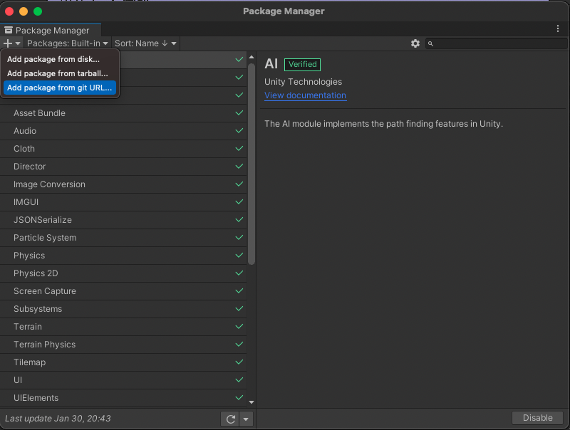
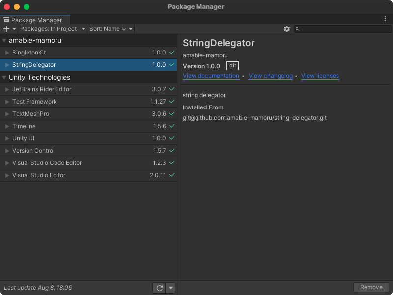
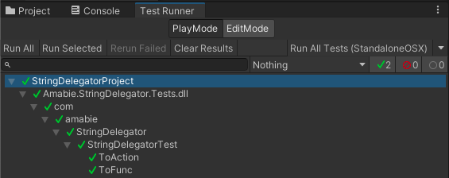

# string-delegator

String delegator for unity

## Get started

First, [Window] -> [Package Manager] on Unity Editor menu bar.

Second, Click [+] button and select [Add package from git URL...]



And finally, copy following url and paste in package manager text box.

```
git@github.com:amabie-mamoru/unity-singleton-kit.git
```



Let's enjoy 🧜

# Features

## StringDelegator (GameObject Extension)

### Interface

#### static methods

Method Name | Description
--- | ---
ToFunc&lt;T&gt;(Type classTypeWithNamespace, string methodName) | Generate Func in GameObject with class type with namespace and method name (return type is T).
ToAction(Type classTypeWithNamespace, string methodName) | Generate Action in GameObject with class type with namespace and method name.

### Usage
```cs
using com.amabie.StringDelegator;

public class Sample: MonoBehaviour
{
    [SerializeField]
    private GameObject gameObj;

    void Awake()
    {
      gameObj = new GameObject();
      gameObj.AddComponent<AttachedClass>();
      gameObj.ToFunc<float>(typeof(AttachedClass), "DummyFunc");
      gameObj.ToAction(typeof(AttachedClass), "DummyAction");
    }

    public class AttachedClass: MonoBehaviour
    {
        public float DummyFunc() => 1.0f;
        public void DummyAction() {}
    }
}
```

# Support

see test codes.


